# Panduan Penggunaan Poliklinik App 

Dokumen ini menjelaskan alur penggunaan fitur Fast Track berdasarkan role: `Admin`, `Dokter`, dan `Pasien`.

## 1. Persiapan Jalankan Aplikasi

1. Install dependency backend dan frontend (jika belum):
   - `composer install`
   - `npm install`
2. Siapkan environment:
   - Pastikan file `.env` sudah ada.
   - Pastikan `BROADCAST_CONNECTION=reverb`.
3. Jalankan migrasi dan seeder:
   - `php artisan migrate`
   - `php artisan db:seed`
4. Jalankan aplikasi (server + reverb + vite sekaligus):
   - `composer run dev`
5. Buka aplikasi di browser:
   - `http://127.0.0.1:8000`

### Menjalankan Multi Role Sekaligus (Tanpa Login-Logout)

Gunakan perintah berikut untuk menjalankan 3 server role sekaligus dengan cookie session terpisah:

- `composer run dev:roles`

Port yang dipakai:
- Admin: `http://127.0.0.1:8000`
- Dokter: `http://127.0.0.1:8001`
- Pasien: `http://127.0.0.1:8002`

Catatan:
- Command ini juga menjalankan `reverb` dan `vite` untuk realtime.
- Karena `SESSION_COOKIE` tiap port berbeda, login admin/dokter/pasien tidak saling menimpa.

## 2. Akun Demo

Setelah seeding, gunakan akun berikut:

- Admin:
  - Email: `admin@gmail.com`
  - Password: `admin`
- Dokter:
  - Email: `dokter@gmail.com`
  - Password: `dokter`
- Pasien:
  - Email: `pasien@gmail.com`
  - Password: `pasien`

### Akun Pasien Untuk Uji Antrean

- `pasien1@gmail.com` / `pasien1`
- `pasien2@gmail.com` / `pasien2`
- `pasien3@gmail.com` / `pasien3`
- `pasien4@gmail.com` / `pasien4`

## 3. Alur Penggunaan Per Role

## 3.1 Pasien

Menu utama pasien:
- Dashboard Pasien
- Riwayat Pendaftaran
- Pembayaran

Alur yang disarankan:

1. Login sebagai pasien.
2. Masuk ke `Dashboard Pasien`.
3. Lihat tabel jadwal poli dan pilih jadwal.
4. Isi keluhan lalu klik `Daftar`.
5. Setelah berhasil daftar:
   - Banner `Antrian Aktif Anda` tampil.
   - Nomor antrian pasien dan nomor yang sedang dilayani akan update otomatis.
6. Cek `Riwayat Pendaftaran` untuk melihat histori daftar poli.
7. Jika status sudah diperiksa, klik `Detail` untuk melihat:
   - Catatan dokter
   - Daftar obat
   - Total biaya
8. Buka menu `Pembayaran`:
   - Lihat tagihan hasil pemeriksaan.
   - Upload foto bukti bayar.
   - Status menjadi `Menunggu Verifikasi`.
9. Tunggu admin verifikasi sampai status berubah `Lunas`.

Catatan aturan antrean:
- Pasien tidak bisa daftar ke dua poli sekaligus.
- Pasien baru bisa daftar lagi setelah pemeriksaan sebelumnya selesai.

## 3.2 Dokter

Menu utama dokter:
- Dashboard Dokter
- Pemeriksaan Pasien

Alur yang disarankan:

1. Login sebagai dokter.
2. Buka `Pemeriksaan Pasien`.
3. Pilih antrean pasien yang menunggu.
4. Isi catatan pemeriksaan.
5. Pilih obat yang akan diresepkan.
6. Simpan pemeriksaan.

Hasil saat simpan pemeriksaan:
- Data pemeriksaan tersimpan.
- Stok obat otomatis berkurang.
- Jika ada obat stok habis/tidak cukup, seluruh proses dibatalkan (rollback) dan tampil error informatif.
- Nomor antrean yang sedang dilayani ter-broadcast realtime ke dashboard pasien.

Export dokter:
- Dari `Dashboard Dokter` bisa export:
  - Jadwal periksa dokter
  - Riwayat pasien yang pernah diperiksa

## 3.3 Admin

Menu utama admin:
- Dashboard Admin
- Manajemen Obat
- Verifikasi Pembayaran

Alur yang disarankan:

1. Login sebagai admin.
2. Buka `Manajemen Obat`.
3. Tambah atau update data obat (`nama`, `kemasan`, `harga`, `stok`).
4. Perhatikan indikator stok rendah pada daftar obat.
5. Buka `Verifikasi Pembayaran`.
6. Cek daftar tagihan yang `Menunggu Verifikasi`.
7. Klik bukti pembayaran untuk meninjau gambar upload pasien.
8. Klik `Konfirmasi Lunas` jika valid.

Hasil verifikasi:
- Status pembayaran berubah menjadi `Lunas`.
- Riwayat verifikasi tercatat (siapa verifier dan kapan diverifikasi).

Export admin:
- Dari dashboard/admin pages tersedia export Excel untuk:
  - Data Dokter
  - Data Pasien
  - Data Obat

## 4. Fitur Real-Time Antrean

Agar update antrean realtime berjalan:

1. Pastikan aplikasi dijalankan dengan `composer run dev`.
2. Perintah ini sudah menjalankan:
   - `php artisan serve`
   - `php artisan reverb:start`
   - `npm run dev`
3. Saat dokter menyimpan pemeriksaan, dashboard pasien otomatis menerima update nomor dilayani.

## 5. Laravel Echo dan Reverb

Bagian ini menjelaskan apa itu Laravel Echo dan Reverb, kenapa dipakai, cara install, serta implementasi di project ini.

### 5.1 Apa itu Laravel Echo?

Laravel Echo adalah library JavaScript di frontend untuk:
- subscribe ke channel websocket,
- listen event broadcast dari Laravel,
- update UI secara real-time tanpa reload halaman.

Di project ini, Echo dipakai di dashboard pasien untuk mendengar event perubahan antrean.

### 5.2 Apa itu Laravel Reverb?

Laravel Reverb adalah server websocket resmi Laravel (self-hosted). Reverb bertugas:
- menerima event broadcast dari backend Laravel,
- mengirim event tersebut ke client yang sedang subscribe,
- menjadi infrastruktur real-time (pengganti layanan websocket pihak ketiga jika ingin lokal/self-hosted).

Di project ini, Reverb dipakai agar perubahan antrean dari dokter langsung terlihat di dashboard pasien.

### 5.3 Gunanya Echo + Reverb di Sistem Antrean Ini

Alur singkat:
1. Dokter menyimpan hasil pemeriksaan.
2. Backend menembakkan event `QueueUpdated`.
3. Reverb menyiarkan event ke channel `queues`.
4. Dashboard pasien (Echo listener) menerima event.
5. Frontend memanggil endpoint snapshot untuk refresh data antrean terbaru.

Hasilnya: pasien tidak perlu refresh manual untuk melihat nomor yang sedang dilayani.

### 5.4 Cara Install dan Setup (Project Baru)

Jika memulai project dari nol, langkah umum:

1. Install package backend Reverb:
   - `composer require laravel/reverb`
2. Install package frontend Echo:
   - `npm install laravel-echo pusher-js`
3. Set environment di `.env`:
   - `BROADCAST_CONNECTION=reverb`
   - `REVERB_APP_ID=...`
   - `REVERB_APP_KEY=...`
   - `REVERB_APP_SECRET=...`
   - `REVERB_HOST=localhost`
   - `REVERB_PORT=8080`
   - `REVERB_SCHEME=http`
   - `VITE_REVERB_APP_KEY="${REVERB_APP_KEY}"`
   - `VITE_REVERB_HOST="${REVERB_HOST}"`
   - `VITE_REVERB_PORT="${REVERB_PORT}"`
   - `VITE_REVERB_SCHEME="${REVERB_SCHEME}"`
4. Jalankan service realtime:
   - `php artisan reverb:start`
5. Jalankan frontend watcher:
   - `npm run dev`

Catatan project ini:
- Dependency `laravel/reverb`, `laravel-echo`, dan `pusher-js` sudah terpasang.
- Konfigurasi default `.env.example` sudah berisi variabel Reverb untuk local development.

### 5.5 Implementasi di Kode Project Ini

Berikut titik implementasi realtime antrean:

1. Konfigurasi broadcasting backend:
   - `config/broadcasting.php`
   - Connection `reverb` membaca `REVERB_*` dari `.env`.

2. Konfigurasi server Reverb:
   - `config/reverb.php`
   - Mengatur host/port server dan kredensial app Reverb.

3. Inisialisasi Echo di frontend:
   - `resources/js/echo.js`
   - `broadcaster: 'reverb'` dan memakai `VITE_REVERB_*`.

4. Load Echo saat bootstrap JS:
   - `resources/js/bootstrap.js`
   - `import './echo';`

5. Definisi event yang dibroadcast:
   - `app/Events/QueueUpdated.php`
   - Implement `ShouldBroadcast`, channel `queues`, event name `queue.updated`, payload `jadwal_id` dan `nomor_dilayani`.

6. Titik trigger event di backend:
   - `app/Http/Controllers/DokterPeriksaController.php`
   - Setelah pemeriksaan tersimpan: `event(new QueueUpdated(...))`.

7. Listener event di frontend pasien:
   - `resources/views/pasien/dashboard.blade.php`
   - `window.Echo.channel('queues').listen('.queue.updated', ...)`.
   - Saat event diterima, frontend memanggil `fetchSnapshot()` untuk update tampilan banner dan tabel antrean.

### 5.6 Cara Cek Realtime Sudah Jalan

1. Jalankan aplikasi dengan `composer run dev` atau `composer run dev:roles`.
2. Login dokter dan pasien di browser berbeda.
3. Dokter simpan pemeriksaan pasien.
4. Pastikan dashboard pasien berubah otomatis tanpa refresh manual.
5. Jika tidak berubah, cek:
   - proses `reverb:start` masih aktif,
   - nilai `REVERB_*` dan `VITE_REVERB_*` sesuai,
   - console browser tidak ada error websocket.

### 5.7 Diagram Alur Realtime Antrean dan Penjelasannya

```mermaid
flowchart LR
A[Dokter klik Simpan Pemeriksaan] --> B[Event QueueUpdated]
B --> C[Broadcast ShouldBroadcast]
C --> D[Laravel Broadcasting reverb]
D --> E[Reverb Server]
E --> F[Channel queues]
F --> G[Frontend subscribe Echo]
G --> H[Listener queue updated]
H --> I[Fetch snapshot]
I --> J[Controller snapshot]
J --> K[Data JSON terbaru]
K --> L[UI update]
```

Penjelasan tiap tahap:

1. **A - Dokter klik Simpan Pemeriksaan**
   Saat dokter menyimpan hasil pemeriksaan, proses backend pemeriksaan dijalankan.

2. **B - Event `QueueUpdated`**
   Setelah data pemeriksaan berhasil disimpan, backend menembakkan event `QueueUpdated`.

3. **C - Broadcast `ShouldBroadcast`**
   Karena event mengimplementasikan `ShouldBroadcast`, Laravel tahu bahwa event ini harus dikirim ke sistem broadcast realtime.

4. **D - Laravel Broadcasting `reverb`**
   Laravel memakai driver broadcast `reverb` (mengacu ke `BROADCAST_CONNECTION=reverb`) untuk mengirim event.

5. **E - Reverb Server**
   Server Reverb yang berjalan menerima event broadcast dari backend.

6. **F - Channel `queues`**
   Event dipublikasikan ke channel `queues`, yaitu channel publik untuk update antrean.

7. **G - Frontend subscribe Echo**
   Browser pasien yang sudah subscribe channel `queues` melalui Laravel Echo akan siap menerima event.

8. **H - Listener `queue.updated`**
   Listener frontend menangkap event `queue.updated` saat event itu datang dari Reverb.

9. **I - Fetch snapshot**
   Setelah event diterima, frontend memanggil endpoint snapshot untuk mengambil kondisi antrean terbaru.

10. **J - Controller snapshot**
    Endpoint snapshot di controller menghitung ulang data antrean aktif dan status nomor yang sedang dilayani.

11. **K - Data JSON terbaru**
    Controller mengembalikan respons JSON terbaru ke frontend.

12. **L - UI update**
    Frontend memperbarui banner dan tabel antrean secara otomatis tanpa refresh manual.

Kesimpulan:
- Event dipakai sebagai pemicu realtime.
- Snapshot dipakai sebagai sumber data final agar tampilan tetap konsisten dengan kondisi database terbaru.

## 6. Troubleshooting Singkat

- Gambar bukti pembayaran tidak tampil:
  - Jalankan `php artisan storage:link`.
- Realtime tidak jalan:
  - Pastikan proses `reverb:start` aktif.
  - Pastikan variabel `REVERB_*` dan `VITE_REVERB_*` terisi di `.env`.
- Data demo tidak muncul:
  - Jalankan ulang `php artisan db:seed`.
